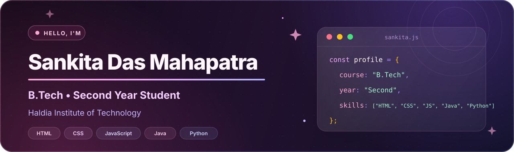

  

  
  
  

## 👩‍💻 About Me

- 🎓 Currently pursuing a **B.Tech in Information Technology** at **Haldia Institute of Technology**
- 💡 Interested in building practical and useful projects
- 🌱 Currently learning **Java, Python, DSA, Web Development, and Flutter**
- 🔧 Exploring **Backend Development** and **Software Development**
- 📚 Always learning and improving my coding skills
- 🤝 Interested in collaborating on student and open-source projects

## 🧰 Tech Stack

<table>
  <tr>
    <td align="center" width="25%"><strong>Languages</strong></td>
    <td align="center" width="25%"><strong>Web Development</strong></td>
    <td align="center" width="25%"><strong>Database</strong></td>
    <td align="center" width="25%"><strong>Currently Exploring</strong></td>
  </tr>
  <tr>
    <td align="center" valign="top">
       
      
        
      <code>Java</code> <code>Python</code> 
      <code>C</code> <code>JavaScript</code>
        
    </td>
    <td align="center" valign="top">
       
      
        
      <code>HTML</code> <code>CSS</code> 
      <code>JavaScript</code>
        
    </td>
    <td align="center" valign="top">
       
      
        
      <code>SQL</code> <code>MySQL</code>
        
    </td>
    <td align="center" valign="top">
       
      
        
      <code>Flutter</code> <code>Dart</code> 
      <code>DSA</code> <code>Backend</code>
        
    </td>
  </tr>
</table>

## 🚀 Featured Projects

<table>
  <tr>
    <td width="50%" valign="top">
      <h3 align="center">🌾 FarmOS</h3>
      
A smart market-linkage platform designed to help farmers compare market opportunities by considering market prices and transportation costs.

      

        
        
        
        
        
      

    </td>
    <td width="50%" valign="top">
      <h3 align="center">💰 Student Expense Tracker</h3>
      
A simple web-based application for tracking and managing student expenses.

      

        
        
        
      

    </td>
  </tr>
</table>

## 📊 GitHub Stats

  
  

  

## 🎯 2026 Goals

- [ ] Improve my problem-solving skills
- [ ] Build more real-world projects
- [ ] Strengthen DSA
- [ ] Learn backend development
- [ ] Build mobile applications using Flutter
- [ ] Contribute to open-source projects

## 📫 Connect With Me

  

<!-- Email and LinkedIn are intentionally omitted until the correct details are provided. -->

---

  <strong>Always learning, always improving. 💜</strong> 
  Thanks for visiting my profile!

